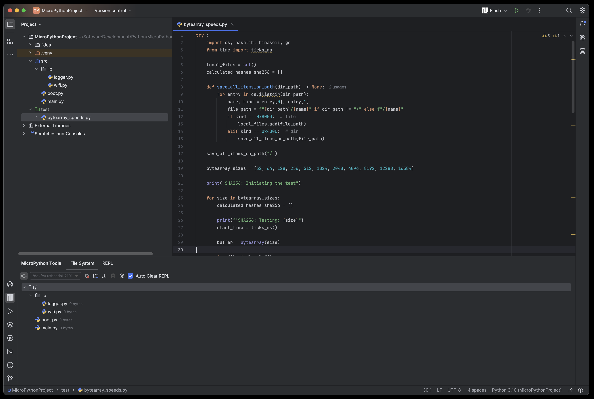
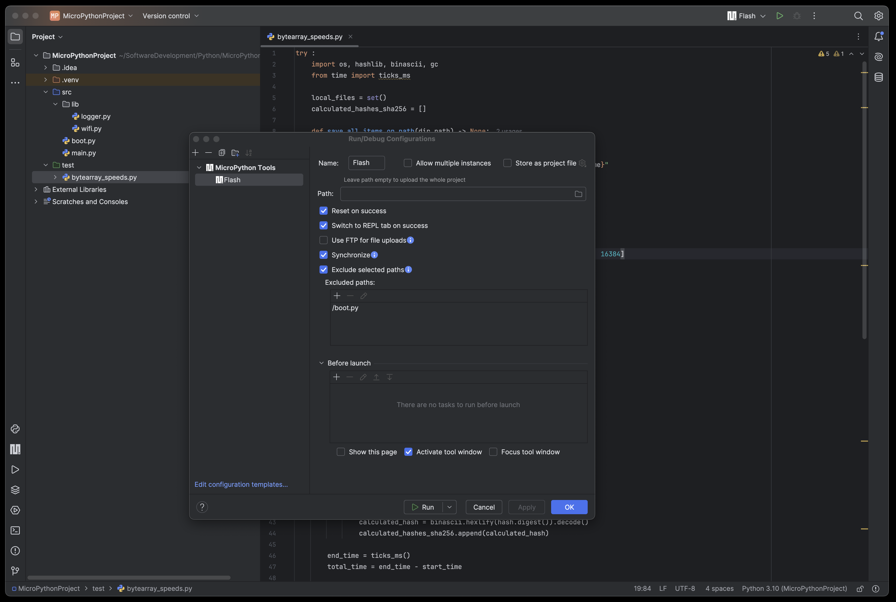
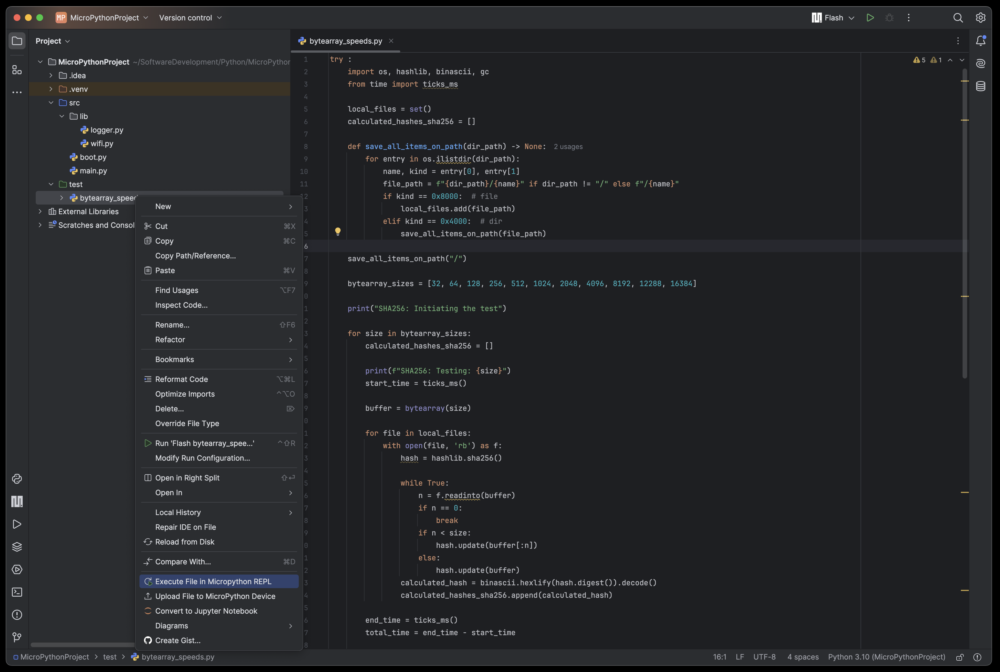
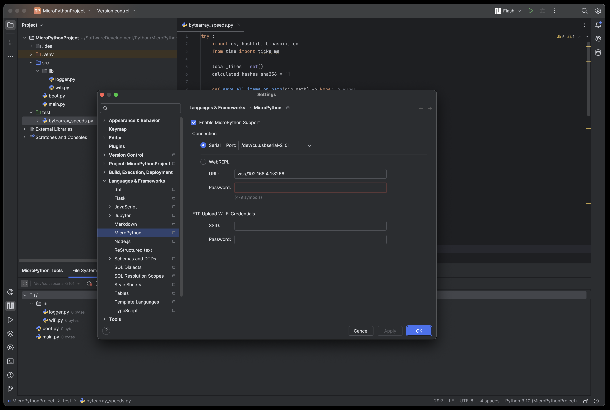

# MicroPython Tools for PyCharm

This is a fork of the [jetbrains intellij micropython plugin](https://github.com/JetBrains/intellij-micropython).
Credits to [Andrey Vlasovskikh](https://github.com/vlasovskikh) for creating the original plugin and
to [Ilia Motornyi](https://github.com/elmot) for rewriting the communication layer to kotlin and for developing the new
UI, which serves as the foundation for this project.

Many thanks also go to all of the contributors who helped maintain and improve the plugin in the past.

I have decided fork the original jetbrains plugin as its development had slowed and I wanted to focus on implementing
more advanced features that I deem invaluable based on my professional experience working with MicroPython

I believe that the MicroPython community needs robust, actively maintained and developed tools adding MicroPython
support to modern industry-standard IDEs. My aim with this fork is to address this need.

There will be frequent updates, I'm actively working on developing new features and fixing bugs in the existing
code. If you run into any problems or bugs using this plugin, please create an issue. For any suggestions or feature
requests, feel free to start a discussion.

Some of the features you can expect soon include:

- New device management and built-in type hint support
- New flashing/upload UI
- Drag and drop file system interaction

Long term plans:

- Built-in MicroPython firmware flashing support
- Rewrite communication layer using pyserial
- Support compiling to bytecode
- After finishing the pyserial communication rewrite I might consider developing MicroPython plugins for Visual Studio
  and VScode as well

## Usage tips

To access all of the features this plugin offers always create a MicroPython Tools run configuration in a new project
and leave the path empty.

If no folder is marked as a sources root, the project root contents will be uploaded, if at least one folder is marked
as a source root, only source root contents will be uploaded. In all cases files/folders with a leading dot in their
name, excluded folders, and test
source roots are skipped. If you want to upload a test source root marked folder, or its contents, you can do so via
the context menu actions.

I also recommend enabling the synchronize option, this way you don't have to worry about cleaning up the File System
if you make large changes to your project. When flashing, all empty folders and files that were not apart of the
flashing operation will be deleted - you can also simply configure excluded target (MicroPython) paths, that will be
ignored by the synchronization feature.

For projects which involve flashing large files *(For MicoPython standards)*, FTP uploads might help speed things up,
especially if you're using serial communication.

## Features

### Expanded File System widget

- With new connection selector for easily switching between devices
  

### Expanded run configuration options

- Synchronization - automatically clean up the device file system when flashing
- Except device paths from synchronization (avoid deleting persistent data such as logs)
- FTP uploads for large projects - increased upload speed and reliability
- New tooltips
  

### Context sensitive menu actions

- Tooltip descriptions dynamically change based on your selection
- You can now select multiple items for the upload action
  

### Cleaned up settings menu

- Removed old unused device type dropdowns
- Updated the settings persistence system to use a more modern approach
- Added a Target Wi-Fi AP configuration for FTP upload functionality (The password is safely stored in
  the [Jetbrains password
  safe](https://plugins.jetbrains.com/docs/intellij/persisting-sensitive-data.html#storage))
  

### Other

- Automatically skips already uploaded files (on boards offering binascii library)
- Several bug fixes, new edge case handling, removed most of the old deprecated code, new python library management
  system and more backend changes

## Supported devices

All MicroPython devices are supported, however, as of right now the plugin does not offer built in type hints. I'm
working on adding them, in the mean time I recommend checking
out https://micropython-stubs.readthedocs.io/en/main/.

## Requirements

* PyCharm or IntelliJ
* Python 3.10+
* Pyserial library installed (the plugin will offer you an option to automatically install it)
* Python plugin (IntelliJ only)
* A development board with MicroPython installed

The plugin is licensed under the terms of the Apache 2 license.
