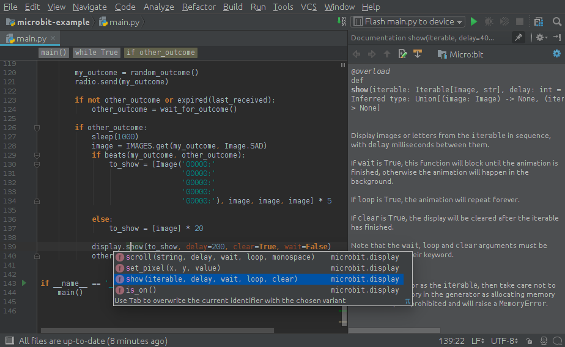

# MicroPython Support for IntelliJ and PyCharm

The plugin for [MicroPython](http://micropython.org/) devices in [IntelliJ IDEA](https://www.jetbrains.com/idea/) and
[PyCharm](https://www.jetbrains.com/pycharm/).

Supported devices:

* [BBC Micro:bit](http://microbit.org/)

That's all for now!

This plugin is in its early beta. It will support more MicroPython devices eventually. We are interested in code
contributions for other devices, especially for these ones:

* PyBoard
* ESP8266-based devices
* Teensy

## Features

* Code insight for MicroPython modules
    * Context-aware code completion and documentation
    * Syntax checking and type checking
* Run code on MicroPython devices
    * Flash Python files to devices
    * MicroPython REPL

## Requirements

* IntelliJ 2017.1 or PyCharm 2017.1
* Python 3.5+

## Installation

Install the "MicroPython Support" plugin from your IDE settings.

The setup steps differ for IntelliJ and PyCharm:

* IntelliJ: Add the MicroPython facet to a Python module in your project structure
* PyCharm: Enable MicroPython support in "File | Settings | Languages & Frameworks | MicroPython"

## Source Code

The plugin is written in [Kotlin](https://kotlinlang.org/). It's a new JVM language by JetBrains, the makers of
IntelliJ and PyCharm. Google recently selected Kotlin as an officially supported language for Android development.

The steps for setting up the development environment:

1. Check out this project from GitHub
2. Create a new project from existing sources in IntelliJ 2017.1 or later

To just run the development version use `./gradlew clean runIde` from the command line.

Contributions are welcome!

## License

The plugin is licensed under the terms of the Apache 2 license.
